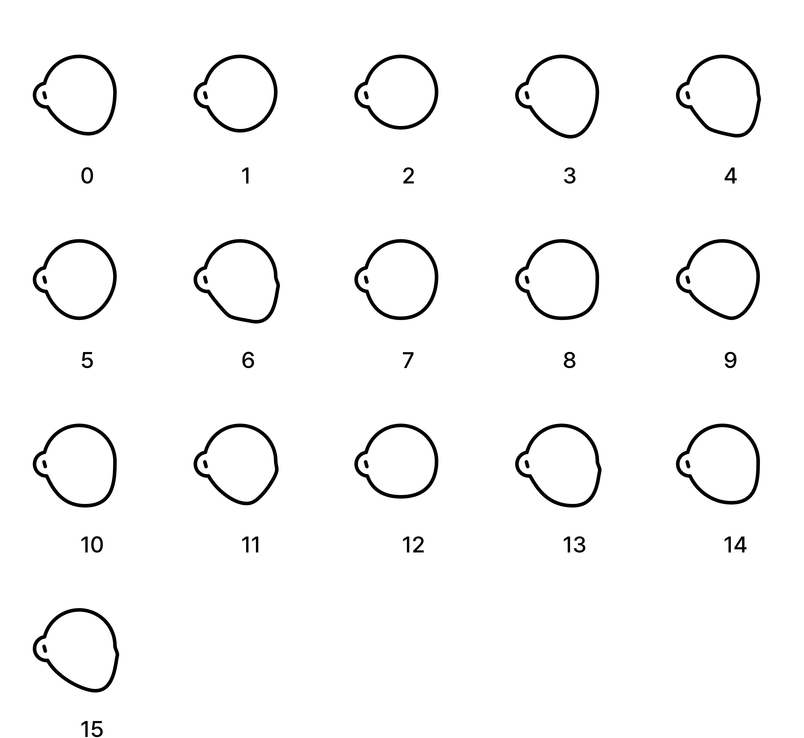

# Notion Avatar Widget

Flutter Widget plugin for generating and displaying Notion Avatars.

## Usage

Wrap the NotionAvatar widget inside a SizedBox to specify the size. Use the `useRandom` property to generate a random avatar.

```dart
SizedBox(
  width: 300,
  height: 300,
  child: NotionAvatar(
    useRandom: true,
    onCreated: (NotionAvatarController controller) {
      this.controller = controller;
    },
  ),
)
```
## Controller Methods

The `NotionAvatarController` provides the following methods to control the avatar:

- `random()`: Generates a random avatar.
- `setAccessories(int index)`: Sets the accessories of the avatar.
- `setEyes(int index)`: Sets the eyes of the avatar.
- `setEyebrows(int index)`: Sets the eyebrows of the avatar.
- `setFace(int index)`: Sets the face of the avatar.
- `setGlasses(int index)`: Sets the glasses of the avatar.
- `setHair(int index)`: Sets the hair of the avatar.
- `setMouth(int index)`: Sets the mouth of the avatar.
- `setNose(int index)`: Sets the nose of the avatar.
- `setDetails(int index)`: Sets the details of the avatar.


## Styles


<details>
<summary>Accessories</summary>


Accessories can be customized using the `NotionAvatarController`'s `setAccessories()` method.

</details>

<details>
<summary>Beard</summary>


Beard styles can be customized using the `NotionAvatarController`'s `setDetails()` method.

</details>

<details>
<summary>Details</summary>


Details can be customized using the `NotionAvatarController`'s `setDetails()` method.

</details>

<details>
<summary>Eyebrows</summary>


Eyebrow styles can be customized using the `NotionAvatarController`'s `setEyebrows()` method.

</details>

<details>
<summary>Eyes</summary>


Eye styles can be customized using the `NotionAvatarController`'s `setEyes()` method.

</details>

<details>
<summary>Face</summary>



Face styles can be customized using the `NotionAvatarController`'s `setFace()` method.

</details>

<details>
<summary>Glasses</summary>


Glasses styles can be customized using the `NotionAvatarController`'s `setGlasses()` method.

</details>

<details>
<summary>Hair</summary>


Hair styles can be customized using the `NotionAvatarController`'s `setHair()` method.

</details>

<details>
<summary>Mouth</summary>


Mouth styles can be customized using the `NotionAvatarController`'s `setMouth()` method.

</details>

<details>
<summary>Nose</summary>


Nose styles can be customized using the `NotionAvatarController`'s `setNose()` method.

</details>

## Assets

- Illustration designer: [@Felix Wong](https://www.producthunt.com/@felix12777) on ProductHunt
- Pack of illustrations: [Noto avatar](https://abstractlab.gumroad.com/l/noto-avatar)
- Assets licensed under [CC0](https://creativecommons.org/publicdomain/zero/1.0/) 
